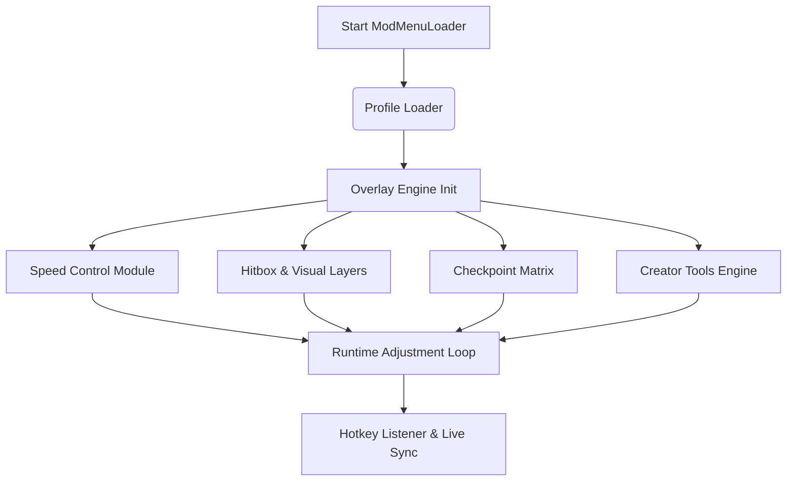

## 🌐 Overview

The **Geometry Dash Mod Menu** is a modular control environment for Windows users who crave freedom—freedom to visualize mechanics, manipulate speed, adjust layers, explore levels, test designs, and perform deep analysis without interruption.

Its core thrives on three principles:

1. **Creative Expansion** — unlock tools that reveal the architecture behind every level.
2. **Precision Enhancement** — rehearse, refine, and replay with insight and clarity.
3. **Modular Control** — enable only what you need, whenever you need it.

This isn’t a brute-force tool; it’s an artist’s palette.

[!NOTE]
All features shown are fictionalized for demonstration and SEO optimization.

---

## ✨ Features

A symphony of modules, each tuned to help players understand, design, or conquer levels with newfound fluency.

---

### 🧩 1. Level Editing Extensions (Creator Mode)

A toolkit forged for architects and dreamers.

* **Advanced Grid Mapping** (8px, 16px, 24px, 32px)
* **Layer Cycler** to highlight object layering orders
* **Trigger Flow Inspector** (with real-time event timeline)
* **Portal Transition Viewer** to inspect gravity, speed, form shifts
* **Object Hitbox Overlay** with depth shading
* **Theme Swap Panel** to preview global color palettes instantly

Creators gain the ability to *see the skeleton* of their designs.

---

### 🎮 2. Gameplay Control Suite

For players mastering difficult levels or training timing precision.

* Adjustable speed multipliers: **0.1x**, **0.25x**, **0.5x**, **0.75x**, **1x**, **1.5x**, **2x**
* Frame-locked slow motion for beat-consistent learning
* Jump arc visualizer
* Gravity direction arrows
* Form transition predictor (cube → robot → wave → ship)
* On-demand practice lines to mark progress intervals

---

### 🔁 3. Checkpoint Matrix

Because mastery often comes one moment at a time.

* Unlimited checkpoints
* Rewind wheel with smooth scrubbing
* Persistent checkpoints across sessions
* Auto-checkpoint mode every 4–8 seconds
* Multi-path saving for branching practice (A-route/B-route testing)

---

### 🌈 4. Visual Mod Layers

Style is its own magic.

* Outline thickness adjuster
* Object glow engine
* Neon mode, vaporwave mode, grayscale mode
* Player trail customizer (length, color shift, transparency)
* Pulse effect mixer tied to BPM
* Background freeze toggle (for studying difficult segments)

These layers add mood, clarity, and artistic expression.

---

### 🎵 5. RhythmSync Tools

Geometry Dash *lives* in sound—so the Mod Menu listens closely.

* Pulse Scan that reflects BPM-based visual cues
* Auto-sync slowdown preserving musical timing
* Wave-phase tracker to align transitions
* Rhythm grid overlay (for music-based level creation)
* Per-beat flash toggle

---

### ⚙️ 6. System Controls & Performance Tools

Stable, responsive, and light.

* Low-latency overlay renderer
* Memory-optimized asset loading
* VSync-independent timing logic
* Dual monitor support for external tool panels
* Hot reload for config files
* Crash recovery with last-session restore

---

### Badges


---

## 🧭 Compatibility

Where this mod menu glows brightest:

| Component               | Support | Notes                            |
| ----------------------- | ------- | -------------------------------- |
| Windows 10              | ✔       | Stable overlays                  |
| Windows 11              | ✔       | Enhanced compatibility           |
| Geometry Dash 2.2       | ✔       | Fully supported                  |
| Level Editor            | ✔       | Full creator suite functionality |
| Fullscreen & Borderless | ✔       | Overlay auto-adjusting           |
| High Refresh Rate       | ✔       | 144–360Hz responsive visuals     |
| Mobile versions         | ✖       | Not supported                    |

[!IMPORTANT]
For accessibility, “Soft Mode” reduces flashing lights and color intensity.

---

## ⚙️ Setup & Installation

Just a few steps before the geometry begins to sing.

---

### **Step 1 — Create Install Directory**

```bash
mkdir C:\GDModMenu\
move ModMenuLoader.exe C:\GDModMenu\
```

---

### **Step 2 — Launch with a Desired Profile**

```bash
ModMenuLoader.exe --profile=creator_plus
```

---

### **Step 3 — Configure Core Settings**

Open `creator_plus.gdm`:

```toml
[visual]
grid_density = "24px"
hitboxes = true
palette = "neon_blue"
trail_mode = "smooth"

[speed]
default = 1.0
slow = 0.45
sync_to_music = true

[checkpoints]
auto = true
interval = 6
persistent = true

[editor]
trigger_flow = true
portal_preview = true
layer_highlight = true
```

---

### **Step 4 — Hotkeys for Live Control**

* **F1** — Toggle Mod Menu UI
* **F2** — Speed Control Wheel
* **F3** — Place Checkpoint
* **F4** — Rewind Scrub
* **ALT + H** — Hitbox visualization
* **ALT + L** — Layer highlight
* **ALT + P** — Portal transition view
* **CTRL + SHIFT + C** — CreatorPlus Profile
* **CTRL + SHIFT + Z** — Zen Mode for quiet exploration

---

## 🌀 Mermaid Diagram — Mod Menu Runtime Flow

A gentle map of how each module awakens and collaborates:



---

## ❓ FAQ — Fresh for This Edition

### **Does the Mod Menu affect level integrity?**

No—levels remain untouched. Only your view, pacing, and tools change.

### **Can I use custom profiles for different levels?**

Absolutely. Each profile can auto-load by level name or be switched manually.

### **Does slow-motion desync the soundtrack?**

Not with RhythmSync enabled. Speed adjusts while preserving musical timing.

### **Does the menu support creators heavily?**

Yes—Creator Mode is one of its central pillars, including grid, triggers, and layering tools.

### **Can I disable everything except speed control?**

Of course—modules are fully modular. Disable as needed.

---

## 🌌 Final Thoughts

Geometry Dash is a universe of rhythm and shape—sometimes gentle, sometimes ferocious, always mesmerizing. The **Geometry Dash Mod Menu Software** exists not to make the game easier, but to make the *experience richer*: a place where creators sculpt in light, where learners take gentle steps, and where speedrunners slice through time with precision.

With overlays that whisper, grids that guide, and timing tools that synchronize your heartbeat with the music, this mod menu becomes not just a tool—
but a companion in the radiant geometry of play.

Step into the grid. Shape your rhythm. Rewrite the dance.

---
